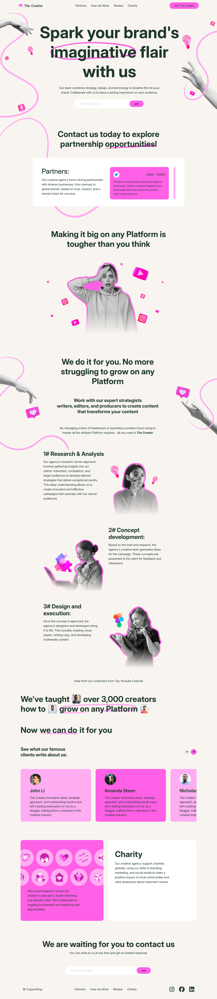

# The Creator

This is a project I made with HTML, CSS, Flexbox and JavaScript.

## Table of Content

- [Overview](#overview)
  - [Description](#description)
  - [Screenshot](#screenshot)
  - [Links](#links)
- [My process](#my-process)
  - [Built with](#built-with)
  - [What I learned](#what-i-learned)
  - [Continued Development](#continued-development)
  - [Useful Resources](#useful-resources)
- [Author](#author)
- [Acknowledgments](#acknowledgments)

## Overview

### Description

I present to you a project I made. The main objective was to reproduce a design from Figma as an exercice for an internship.
It consist of a landing page containing a multiple section :

    - A header
    - A "Hero" section
    - A "Partner" section
    - A "How we Work" section divided in three subsection
    - A "Review" section
    - A "Reliability" section
    - A footer

There is also some interactivity made with JavaScript.
This project works only on desktop computer !

### Screenshot



### Links

- [Live Site](https://sephydev.github.io/the-creator/)

## My process

### Built with

- Semantic HTML5
- CSS
- Flexbox
- JavaScript

### What I learned

Thanks to this project, I've practiced some semantic HTML, CSS and Flexbox. The following snippets are some examples of the knowledges I used.

- Semantic HTML5 (`<footer>`):

```html
<header>
  
  <nav>
    <ul>
      <li><a href="#">Partners</a></li>
      <li><a href="#">How we Work</a></li>
      <li><a href="#">Review</a></li>
      <li><a href="#">Charity</a></li>
    </ul>
  </nav>
  <button><a href="#">Join The Creator</a></button>
</header>
```

- CSS (`.review-control button`):

```css
.review-control button {
  border-radius: 50rem;
  width: 2.5rem;
  height: 2.5rem;
  padding: 0;
}
```

- Flexbox (`.review-carousel`):

```css
.review-carousel {
  display: flex;
  max-width: 81%;
  margin: 0 auto;
  gap: 2rem;
  flex-wrap: nowrap;
  overflow-x: hidden;
  margin-bottom: 5rem;
}
```

- JavaScript (`partnerCarousel.addEventListener`)

```javascript
partnerCarousel.addEventListener("wheel", function (e) {
  if (e.deltaY > 0) {
    partnerCarousel.scrollLeft += 50;
    e.preventDefault();
  } else {
    partnerCarousel.scrollLeft -= 50;
    e.preventDefault();
  }
});
```

### Continued Development

Seeing how Flexbox simplify webpage organization, and how JavaScript can be useful for adding interactivity on a webpage, I will continue to master these technologies.
I will do that by using those on other project, notably to make responsive and interactive website.

### Useful Resources

- [Guide to Flexbox (CSS Trick)](https://css-tricks.com/snippets/css/a-guide-to-flexbox/)

## Author

- Website : Sephydev

## Acknowledgment

Thanks to my friends and my family for supporting me while I journey in the land of Web Development, and during the making of this project !
